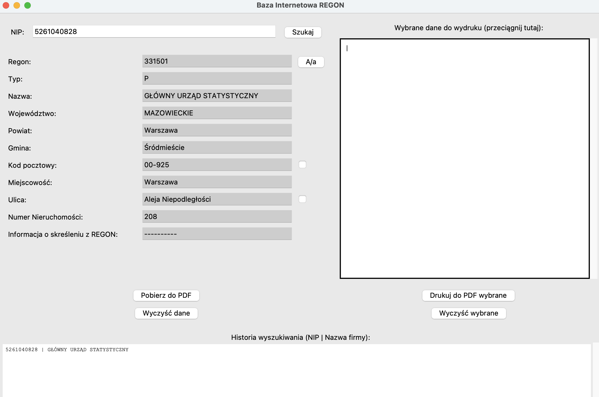
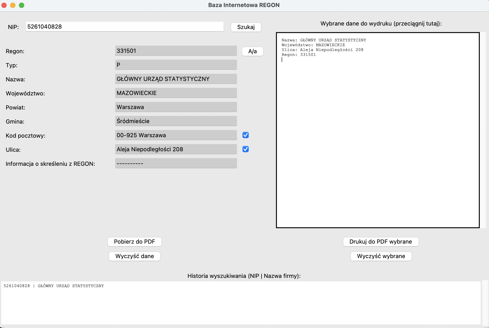
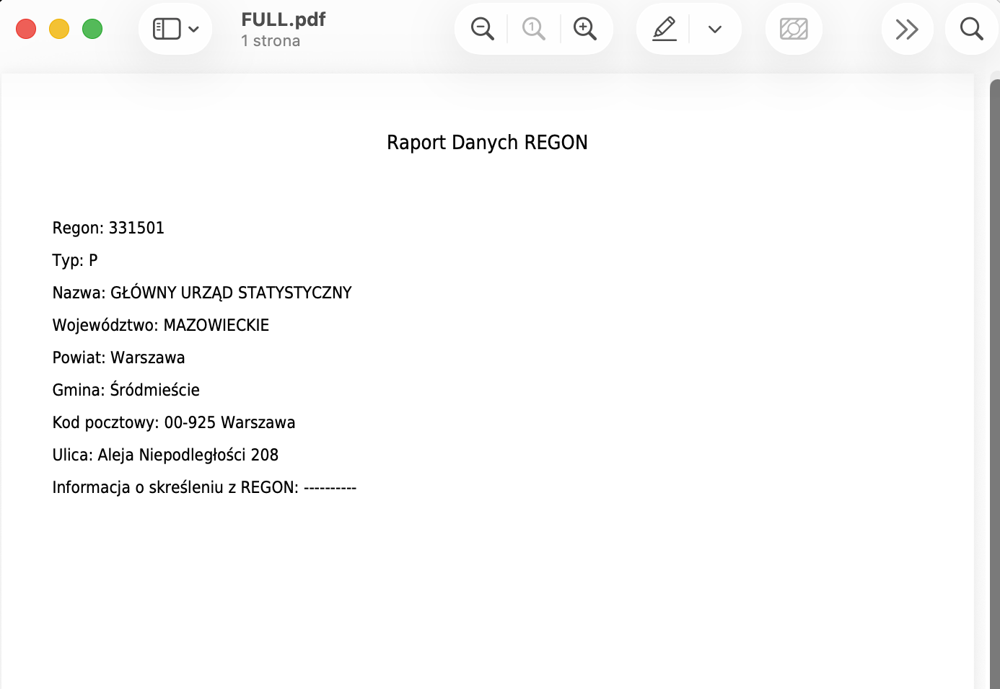

# REGON Database Client (Python & Tkinter)

A desktop application written in Python designed to automate the retrieval of company data from the Polish Central Statistical Office (GUS) database (REGON system) using a NIP (Tax Identification Number). The application features a graphical user interface (GUI), search history management, and PDF report generation.

## 🚀 Features

* **Data Retrieval:** Fetch detailed company information (Name, Address, Termination Date, etc.) based on NIP.
* **Drag & Drop Interface:** Build custom reports by dragging specific data fields from the form to the report panel.
* **PDF Export:**
    * Generate a full report from the fetched data.
    * Generate a custom report using only selected/dragged data.
    * Full support for Polish characters (UTF-8).
* **Search History:** Automatically saves recent searches locally. Double-click an entry to reload the data.
* **Data Manipulation:**
    * Merge/Split address fields (Street + House No., Zip + City).
    * Toggle letter case (Uppercase/Original).
* **Security:** The API key is not hardcoded. The application prompts for it upon the first launch and saves it securely in a local file.

## 📸 Application Overview

### 1. Data Retrieval & Formatting
Enter a NIP number to instantly fetch company details. The interface allows you to merge address fields (Street + Number) or toggle letter casing (A/a) for better readability.



### 2. Drag & Drop Report Builder
Need a specific report? Simply drag and drop the desired fields from the left panel into the editor on the right to create a custom compilation.



### 3. PDF Generation
Export the full dataset or your custom selection to a clean, formatted PDF file with full support for Polish characters.



---

## 🛠️ Requirements & Installation

### 1. Prerequisites
* Python 3.x
* OS: Windows / macOS / Linux
* Active API key for the REGON (BIR1) system.

### 2. Install Dependencies
Install the required Python libraries using pip:

```bash
pip install litex.regon lxml fpdf tk
```
Note: The litex.regon library is a wrapper for the GUS API. Ensure you have an active internet connection.

### 3. Required Font File

To correctly generate PDF files with Polish characters, the following font file must be present in the application's root directory:

**DejaVuSansCondensed.ttf**

Without this file, the PDF export feature will fail or characters will not render correctly.

## 🔑 API Key

Upon the first launch, the application will ask for your **User API Key (BIR1)**. You can obtain this key by applying to the Central Statistical Office (GUS) or by using a test key (if provided publicly by GUS).

The key is saved locally in api_key.txt.

This file is ignored by Git (via .gitignore), ensuring your key remains private and is not pushed to the repository.

You can reset the key at any time using the "Reset API Key" (Zresetuj klucz API) button in the app.

## ▶️ Usage

To run the application from the source code:

```bash
python testbir.py
```

## 📦 Building an Executable (Optional)

If you wish to build a standalone .exe file and you have the testbir.spec file (generated by PyInstaller):

1. Install PyInstaller:

```bash
pip install pyinstaller
```

2. Run the build command:

```bash
pyinstaller testbir.spec
```

The executable will be generated in the dist/ folder. Important: Remember to manually copy the .ttf font file into the dist/ folder so the executable can find it!

## 📂 File Structure

* testbir.py - Main application source code.
* DejaVuSansCondensed.ttf - Font file required for PDF generation.
* api_key.txt - File containing your API key (generated automatically, do not commit to GitHub).
* historia_regon.txt - Local search history (generated automatically).